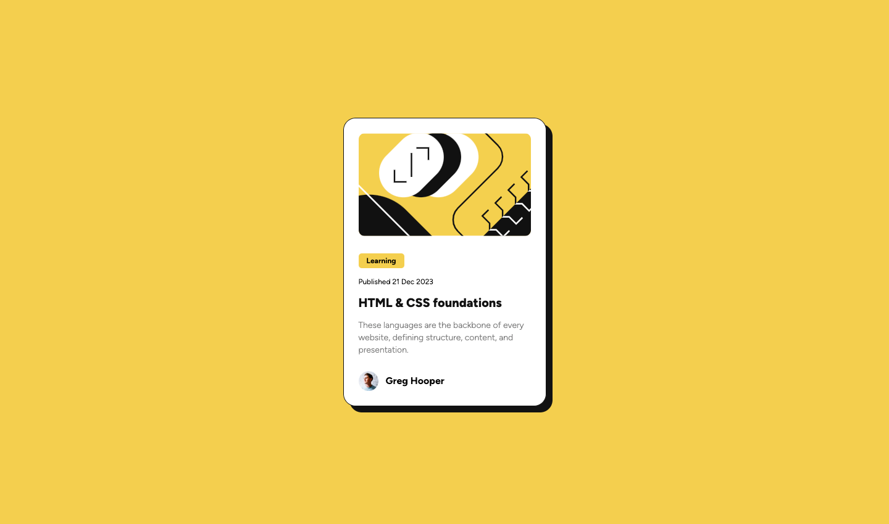

# Frontend Mentor - Blog preview card solution

This is a solution to the [Blog preview card challenge on Frontend Mentor](https://www.frontendmentor.io/challenges/blog-preview-card-ckPaj01IcS). Frontend Mentor challenges help you improve your coding skills by building realistic projects.

## Table of contents

- [Overview](#overview)
  - [The challenge](#the-challenge)
  - [Screenshot](#screenshot)
  - [Links](#links)
  - [Built with](#built-with)
  - [Continued development](#continued-development)
- [Author](#author)

## Overview

### The challenge

Users should be able to:

- See hover and focus states for all interactive elements on the page

### Screenshot

### Links

- Solution URL: [GitHub](https://github.com/laurellx/blog-preview-card-main)
- Live Site URL: [Vercel](https://blog-preview-card-main-swart.vercel.app/)

### Built with

- Semantic HTML5 markup
- CSS custom properties
- Flexbox
- SASS
- Mobile-first workflow

### Continued development

With this project I used the Figma design file that came along with it; it has been my first time using it and I believe it helped; nonetheless, I am aware that there are some discrepancies between the desired output and the result I got. It is not perfect but I am satisfied with the result.

## Author

- GitHub - [@laurellx](https://github.com/laurellx)
- Frontend Mentor - [@laurellx](https://www.frontendmentor.io/profile/laurellx)
